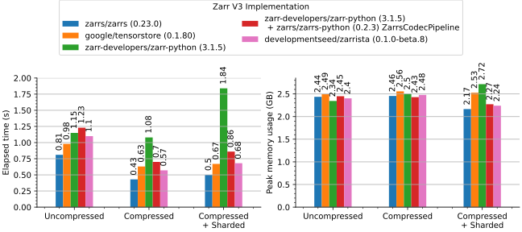
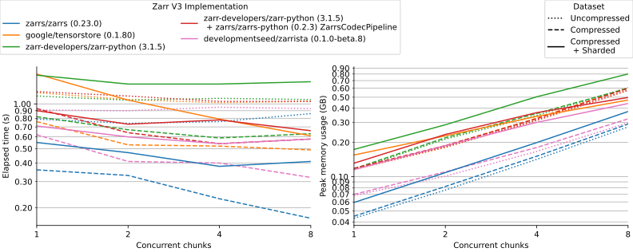
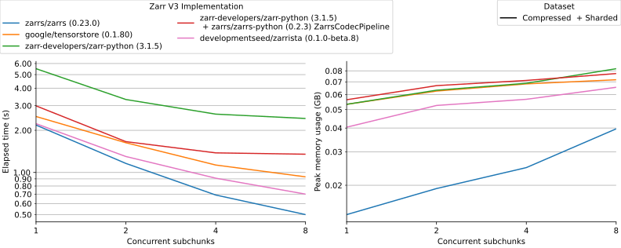

# zarrista

[![PyPI][pypi_badge]][pypi_link]

[pypi_badge]: https://badge.fury.io/py/zarrista.svg
[pypi_link]: https://pypi.org/project/zarrista/

A fast, low-level [Zarr] API for Python, powered from Rust by [Zarrs].

[Initial benchmarks](https://github.com/zarrs/zarr_benchmarks/pull/12) suggest Zarrista is **1.9x to 2.7x faster** than [Zarr-Python] for reading compressed or compressed+sharded data, respectively, from a local file system. We expect future async-focused benchmarks to be even faster.

While Zarrista will exist as a standalone Python library and can be used directly, the goal is to integrate Zarrista directly into [Zarr-Python] so that existing users can get improved performance out of the box and to avoid fracturing the ecosystem.

This library is beta-quality. The underlying [Zarrs] library is reliable and broadly used. The way we expose a Python API from it may change in the future.

[Zarr]: https://zarr.dev/
[zarrita.js]: https://zarrita.dev/
[Zarrs]: https://zarrs.dev/
[Zarr-Python]: https://zarr.readthedocs.io/en/stable/

## Documentation

[**Documentation website.**](https://developmentseed.org/zarrista/latest)

## Features

- **High-performance Rust core**
    - Encoded chunk access allows explicitly managing IO-bound data access and CPU-bound decoding separately.
- **Sync/Async support**
    - Synchronous [`Array`] and [`Group`] for local file system access
    - [Asynchronous][`AsyncArray`] [counterparts][`AsyncGroup`] for remote data access through [Obstore]
- **NumPy integration**
- **Zero-copy data exchange** via [DLPack], the buffer protocol, and Arrow.
- **Broad data type support** including variable-length string/bytes and the machine-learning float and sub-byte integer types (integrating with [`ml_dtypes`]).
- **Broad codec support**, including all in the Zarr v3 spec.
- **Full type hinting** for all operations.
- **[Icechunk]** integration

[NumPy]: https://numpy.org/
[Icechunk]: https://icechunk.io/
[`Array`]: https://developmentseed.org/zarrista/latest/api/array/#zarrista.Array
[`AsyncArray`]: https://developmentseed.org/zarrista/latest/api/array/#zarrista.AsyncArray
[`Group`]: https://developmentseed.org/zarrista/latest/api/group/#zarrista.Group
[`AsyncGroup`]: https://developmentseed.org/zarrista/latest/api/group/#zarrista.AsyncGroup
[Obstore]: https://github.com/developmentseed/obstore
[`Tensor`]: https://developmentseed.org/zarrista/latest/api/tensor/#zarrista.Tensor
[DLPack]: https://dmlc.github.io/dlpack/latest/
[`ml_dtypes`]: https://github.com/jax-ml/ml_dtypes
[Tensorstore]: https://github.com/google/tensorstore

## Benchmarks

In [our PR](https://github.com/zarrs/zarr_benchmarks/pull/12) to [`zarr_benchmarks`](https://github.com/zarrs/zarr_benchmarks), Zarrista is the fastest Python chunked array library, in line with Google's [Tensorstore]. It's surpassed only by the Rust [Zarrs] library, which Zarrista uses internally.

### Read All

The minimum time and peak memory usage to read an entire dataset into memory.



### Read Chunk-By-Chunk

The minimum time and peak memory usage to read a dataset chunk-by-chunk into memory.



### Read Subchunk-By-Subchunk

The minimum time and peak memory usage to read a dataset subchunk-by-subchunk into memory.



## Example

Open a store, then open an `Array` from it:

```py
from zarrista import Array
from zarrista.store import FilesystemStore

store = FilesystemStore("data/example.zarr")
array = Array.open(store, path="/temperature")
```

Inspect the array's metadata:

```py
array.shape
# [720, 1440]

array.dtype
# DataType(float32 / <f4)

array.dimension_names
# ["lat", "lon"]
```

Read a subset of the array. Indexing returns a [`Tensor`], which converts to a [NumPy] array:

```py
data = array[0:128, 0:128]
arr = data.to_numpy()
arr.shape
# (128, 128)
```

You can also read individual chunks by their grid index:

```py
data = array.retrieve_chunk([0, 0])
```

## AI Usage

Zarrista's source code is _minimally_ vibe-coded.

Most of the library code was written by hand by Kyle, sometimes resulting from a conversation with Claude.

Documentation and type stubs are mixed. Much documentation is written by hand but Python type stubs are partially kept up to date via Claude.

Almost all current tests were written by Claude.
